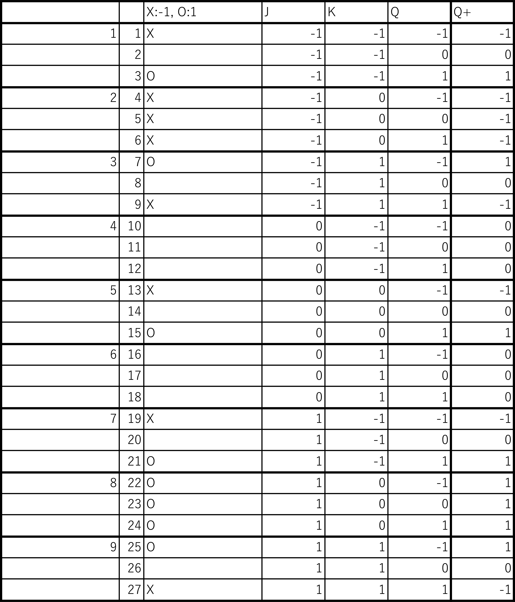

______________________________________________________________________________
# 1. JK-Flip-flop.md
初稿: 2018/10/19 (金) 21:48

______________________________________________________________________________
# 2. JK-Flip-flopの特徴
JK-Flip-flop (JK-FF)は、-1, 0, 1を記憶する。
JS-FFは、演算結果の $\overline{Q}, Q, -1, 0, 1$ が得られる。
各入力値(J,K)を変えることで、SetReset-FF, Toggle-FF, Delay-FFを再現できる。

______________________________________________________________________________
# 3. 特性表

JK-FFの特性表を以下のように定める。
$Q^+$ は、次状態とする。

|  J   |  K   |  $Q^+$ |
| ---- | ---- | ----   |
|  -1  |  -1  | $Q$ |
|  -1  |   0  | -1|
|  -1  |   1  | $\overline{Q}$ |
|   0  |  -1  | 0 |
|   0  |   0  | $Q$ |
|   0  |   1  | 0 |
|   1  |  -1  | $Q$|
|   1  |   0  | 1 |
|   1  |   1  | $\overline{Q}$ |

______________________________________________________________________________
# 展開特性表

各値 ($J,K,Q$) における演算結果 $Q^+$ を記述する。

以下の対応表のように値と記号を定める。

- 記号と値の関係

|  値  |  記号  |
| ---- | ----  |
|  -1  |  X    |
|   0  |  無し |
|   1  |  O    |

- 展開特性表

