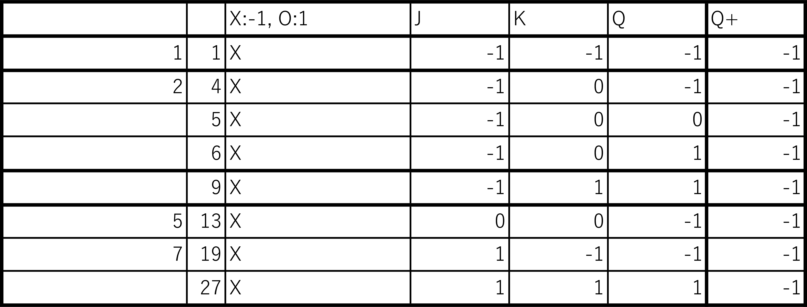

______________________________________________________________________________
# 1. JK-Flip-flop.md
初稿: 2018/10/19 (金) 21:48

______________________________________________________________________________
# 2. JK-Flip-flopの特徴
JK-Flip-flop (JK-FF)は、-1, 0, 1を記憶する。
JS-FFは、演算結果の $\bar{Q}, Q, -1, 0, 1$ が得られる。
各入力値(J,K)を変えることで、SetReset-FF, Toggle-FF, Delay-FFを再現できる。

______________________________________________________________________________
# 3. 特性表

JK-FFの特性表を以下のように定める。
$Q^+$ は、次状態とする。

|  J   |  K   |  $Q^+$ |
| ---- | ---- | ----   |
|  -1  |  -1  | $Q$ |
|  -1  |   0  | -1|
|  -1  |   1  | $\bar{Q}$ |
|   0  |  -1  | 0 |
|   0  |   0  | $Q$ |
|   0  |   1  | 0 |
|   1  |  -1  | $Q$|
|   1  |   0  | 1 |
|   1  |   1  | $\bar{Q}$ |

______________________________________________________________________________
# 4. 展開特性表

各値 ($J,K,Q$) における演算結果 $Q^+$ を記述する。

## 4.1. 記号と値の関係
以下の対応表のように $Q^+$ の値に応じて記号を定める。

|  値 ($Q^+$)  |  記号  |
| ---- | ----  |
|  -1  |  X    |
|   0  |  無し |
|   1  |  O    |

## 4.2. 展開特性表

______________________________________________________________________________
# 5. 拡大入力要求表

O ($Q^+a$), X ( $Q^+b$) における拡大入力要求表を作成する。

## 5.1. O ($Q^+a$) における拡大入力要求表

拡大入力要求表における 22, 23, 24の項については、Qの値に関係なくQ+の値を算出できる。

拡大入力表における 3, 7, 15, 21, 22, 23, 24, 25の項をまとめると以下のようになる。
$$Q^+a=JbKbQa + JbKaQb + \bar{Ja}\bar{Jb}\bar{Ka}\bar{Kb}Qa + JaKbQa + Ja\bar{Ka}\bar{Kb} + JaKaQb$$

上記から式を共通項を出すと以下のように変形できる。
$$Q^+a=Qa(JbKb + JaKb + \bar{Ja}\bar{Jb}\bar{Ka}\bar{Kb}) + Qb(JaKa + JbKa) + Ja\bar{Ka}\bar{Kb}$$

括弧の中の共通項を出すと以下のように変形できる。
$$Q^+a=Qa(Kb(Ja + Jb) + \bar{Ja}\bar{Jb}\bar{Ka}\bar{Kb}) + QbKb(Ja + Jb) + Ja\bar{Ka}\bar{Kb}$$

## 5.2. X ( $Q^+b$) における拡大入力要求表

拡大入力要求表における 4, 5, 6の項については、Qの値に関係なくQ+の値を算出できる。

拡大入力表における 1, 4, 5, 6, 9, 13, 19, 27の項をまとめると以下のようになる。
$$Q^+a=JbKbQb + JbKaQa + \bar{Jb}\bar{Jb}\bar{Ka}\bar{Kb}Qa + JaKbQb + Jb\bar{Ka}\bar{Kb} + JaKaQa$$

上記から式を共通項を出すと以下のように変形できる。
$$Q^+b=Qb(JbKb + JaKb + \bar{Ja}\bar{Jb}\bar{Ka}\bar{Kb}) + Qa(JaKa + JbKa) + Jb\bar{Ka}\bar{Kb}$$

括弧の中の共通項を出すと以下のように変形できる。
$$Q^+b=Qb(Kb(Ja + Jb) + \bar{Ja}\bar{Jb}\bar{Ka}\bar{Kb}) + QaKa(Ja + Jb) + Jb\bar{Ka}\bar{Kb}$$
